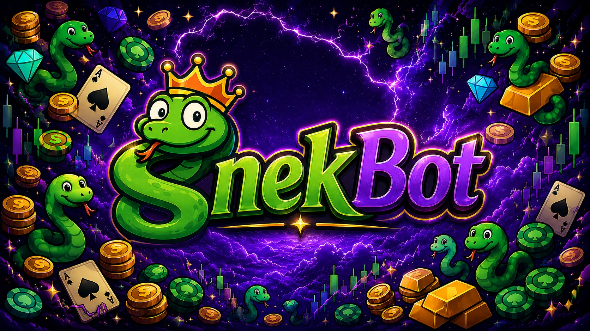

  

  # SnekBot 🐍 💸

  **A playful financial market game/simulator for Discord**

## About SnekBot

SnekBot is a small private project and a playful financial market game on
Discord.

You can trade different assets via Spot or Futures, track your portfolio and
compete with others on the leaderboard. The SnekMarket follows simplified
real-market mechanics such as trends, volatility and corrections, so prices do
not feel random. It is designed to provide a light, game-like trading
experience without being overly complex or serious.

I built SnekBot mainly to experiment with and test ideas, so things may change
over time. It is not meant to be perfect—just fun to use and explore!

## Features

- Server-specific virtual economies with globally shared market prices
- Spot and Futures trading
- Portfolios, rankings and user profiles
- Simulated trends, volatility, market events and corrections
- Automated S-Bot strategies
- Casino, Slots, Deathroll and multiplayer games using virtual SNEK
- Daily rewards, Work rewards and user-to-user transfers
- Personal data access and deletion through `/privacy`

> SNEK, assets, rewards and game stakes are fictional game values only. They
> have no real-world monetary value. SnekBot does not provide financial advice
> and does not accept or pay out real money.

## Information

- [Website](index.html)
- [Privacy Policy](privacy.html)
- [Terms of Service](terms.html)
- [Contact](contact.html)
- [Support Server](https://discord.gg/pMEtS9te73)

---

## Deutsch

SnekBot ist ein kleines privates Projekt und ein spielerisches
Finanzmarktspiel/Simulator auf Discord. Du kannst verschiedene Assets über Spot
oder Futures handeln, dein Portfolio verfolgen und dich in den Ranglisten mit
anderen messen.

Der SnekMarket orientiert sich an vereinfachten Mechaniken realer Märkte wie
Trends, Volatilität und Korrekturen, damit sich die Preise nicht rein zufällig
anfühlen. Das Ziel ist ein lockeres, spielerisches Trading-Erlebnis, ohne
unnötig kompliziert oder ernst zu sein.

Sämtliche SNEK-Beträge, Assets, Belohnungen und Spieleinsätze sind ausschließlich
virtuelle Spielwerte ohne realen Geldwert.

**Have fun! ^_^**
